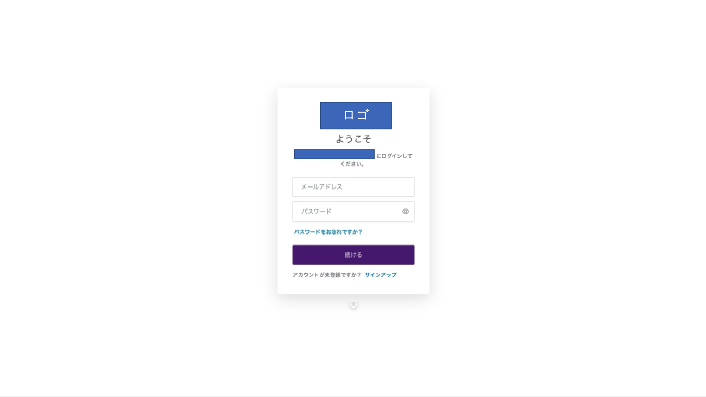

# signup_with_auth0
## この記事について
Reactでauth0(SPAモード)利用時のサインアップボタン作成手順について解説します。  

## 前提
- React
    - react@17.0.2
- node
    - v14.17.4
- yarn
    - 1.22.11
- auth0
    - @auth0/auth0-react@1.7.0
    - @auth0/auth0-spa-js@1.17.1
    - auth0については[こちら]("https://auth0.com/jp")

## 要約
useAuth0利用時に、**loginWithRedirect**のpropertyに **screen_hint:"signup"** を指定しましょう。

```typescript
      <Button
        color="primary"
        style={{ maxWidth: '180px', minWidth: '180px' }}
        variant="contained"
        onClick={() => loginWithRedirect({ screen_hint: 'signup' })}
      >
```

## 詳細
### 背景
Reactでauth0を利用する時、useauth0というモジュールを組み込むと、簡単にログイン機能を実装することができます。  
イベントハンドラと、useauth0のloginWithRedirectというコンポーネントを利用することでサインイン用のボタンを作成することができるのですが、プロパティを指定しなければ、下記のようなユニバーサルログイン画面へ誘導されます。  

    
プロパティに **screen_hint:'signup'** を指定することで、ユニバーサルログイン画面ではなく、サインアップ画面を表示することが可能です。  
[画像](img/001-1.png)

以上