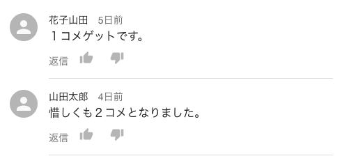
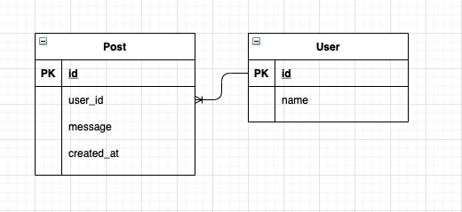
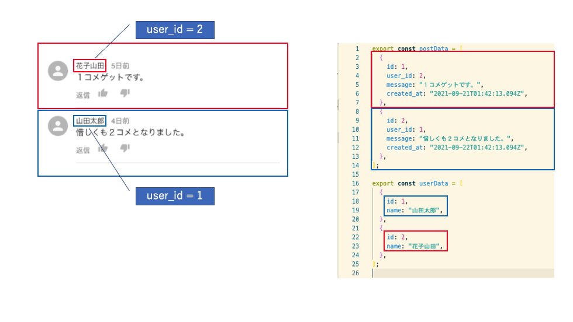

# react_mui_comment_list_mock
## はじめに
### この記事について
ReactとMaterial-UIを用いて、Youtubeのコメント欄ライクなUIを作る方法について解説します。

### 完成イメージ
 

## 前提
### 使用するデータについて
実際の業務では、「投稿」と「ユーザー」のオブジェクトを別々のテーブルとして、DB上で管理しているケースが多いかと思います。  
今回に関しては、APIサーバーからデータを取得するケースを想定します。  
「投稿」を意味するデータである"Post"というjson配列、  
「ユーザー」を意味するデータの"User"というjson配列を用いたうえで、UIを組み立ててみたいと思います。  


### 環境
- React
    - react@17.0.2
- node
    - v14.17.4
- yarn
    - 1.22.11
- Typescript
    - typescript@3.9.7
- Material-UI
    - [v4.0](https://v4.mui.com/)
- MomentJS
    - moment@2.29.1

## 要点
JavaSciriptのArrayオブジェクトの2つのメソッドを上手く利用し、User配列とPost配列をキー項目で結合しましょう。
- [Array.prototype.map()](https://developer.mozilla.org/ja/docs/Web/JavaScript/Reference/Global_Objects/Array/map)
- [Array.prototype.find()](https://developer.mozilla.org/ja/docs/Web/JavaScript/Reference/Global_Objects/Array/find)

コード例
```
{posts?.map((post) => {
          const found = users?.find((user) => post.user_id === user.id);
          ....
```

## 詳細
### ①Reactアプリの作成  
まずはじめに、React Appを作成しましょう。  
```
$ npx create-react-app test --template=typescript
```
### ②yarnからパッケージを取得  
Appの作成が終わったら、yarnを使ってパッケージを取得しましょう。
```
$ yarn add @material-ui/core @material-ui/icons moment
```
### ③データファイルの作成  
「投稿」と「ユーザー」を表すデータファイルを作成しましょう。
```typescript:data.ts
export const postData = [
  {
    id: 1,
    user_id: 2,
    message: '１コメゲットです。',
    created_at: '2021-09-21T01:42:13.094Z',
  },
  {
    id: 2,
    user_id: 1,
    message: '惜しくも２コメとなりました。',
    created_at: '2021-09-22T01:42:13.094Z',
  },
];

export const userData = [
  {
    id: 1,
    name: '山田太郎',
  },
  {
    id: 2,
    name: '花子山田',
  },
];
```
### ④presentational componentの作成  
1. Postコンポーネント  
個別のPostを表現するコンポーネントを作成しましょう。  
後述のPostListコンポーネントからpropsを受け取り、Postをレンダリングするためのコンポーネントです。  
MomentJSを利用することで、「何秒前」や、「何分前」といった投稿時間の表記を実装しています。
```typescript:src/Post.tsx
import { VFC } from "react";

// MomentJSをインポートし、localeをjaに設定する
import moment from "moment";
import "moment/locale/ja";

import { createStyles, makeStyles, Theme } from "@material-ui/core/styles";
import ListItem from "@material-ui/core/ListItem";
import Divider from "@material-ui/core/Divider";
import ListItemText from "@material-ui/core/ListItemText";
import Typography from "@material-ui/core/Typography";
import { Avatar, ListItemAvatar } from "@material-ui/core";
import ThumbUpIcon from "@material-ui/icons/ThumbUp";
import ThumbDownIcon from "@material-ui/icons/ThumbDown";

const useStyles = makeStyles((theme: Theme) =>
  createStyles({
    inline: {
      display: "inline",
    },
    margin: {
      margin: theme.spacing(1, 1, 0, 2),
    },
  })
);

type Props = {
  key: number;
  name: string;
  message: string;
  created_at: string;
};

const Post: VFC<Props> = (props) => {
  const classes = useStyles();
  const { key, name, message, created_at } = props;

  return (
    <div>
      <>
        <ListItem alignItems="flex-start" key={key}>
          <ListItemAvatar>
            <Avatar alt="" />
          </ListItemAvatar>
          <ListItemText
            primary={
              <>
                <Typography
                  component="span"
                  variant="body2"
                  className={classes.inline}
                  color="textPrimary"
                >
                  {name}
                </Typography>
                <Typography
                  component="span"
                  variant="body2"
                  className={classes.inline}
                  color="textSecondary"
                >
                  　{moment(created_at).fromNow()}
                </Typography>
              </>
            }
            secondary={
              <>
                <Typography
                  component="span"
                  variant="body1"
                  className={classes.inline}
                  color="textPrimary"
                >
                  {message}
                </Typography>
                <br />
                返信
                <ThumbUpIcon
                  className={classes.margin}
                  color="disabled"
                  fontSize="small"
                />
                <ThumbDownIcon
                  className={classes.margin}
                  color="disabled"
                  fontSize="small"
                />
              </>
            }
          />
        </ListItem>
        <Divider variant="inset" component="li" />
      </>
    </div>
  );
};

export default Post;
```  
2. PostListコンポーネント  
Postの一覧を表現するコンポーネントを作成しましょう。  
data.tsからjson配列を取得し、propsをPost.tsxに渡すことで、Postの一覧をレンダリングします。  
postsに対するmapメソッドと、usersに対するfindメソッドを組み合わせることで、  
postData内のuser_idと、userData内のidを結合しています。
```TypeScript:src/PostList.tsx
import { VFC } from "react";
import { createStyles, makeStyles, Theme } from "@material-ui/core/styles";
import List from "@material-ui/core/List";

import Post from "./Post";
import { postData, userData } from "./data";

const useStyles = makeStyles((theme: Theme) =>
  createStyles({
    root: {
      width: "25vw",
    },
    txt: {
      margin: theme.spacing(2),
    },
  })
);

type PostData = {
  id: number;
  user_id: number;
  message: string;
  created_at: string;
};

type User = {
  id: number;
  name: string;
};

const PostList: VFC = () => {
  const classes = useStyles();
  const posts: PostData[] = postData;
  const users: User[] = userData;

  return (
    <div>
      <List className={classes.root}>
        {posts?.map((post) => {
          const found = users?.find((user) => post.user_id === user.id);
          return (
            <Post
              key={post.id}
              name={found?.name as string}
              message={post.message}
              created_at={post.created_at}
            />
          );
        })}
      </List>
    </div>
  );
};

export default PostList;
```

3. Appコンポーネント  
最後に、PostListをApp.tsxに組み込みましょう。
```TypeScript:src/App.tsx
import "./App.css";

import { VFC } from "react";
import PostList from "./PostList";

const App: VFC = () => {
  return (
    <div className="App">
      <PostList />
    </div>
  );
};

export default App;

```

### ⑤確認
実際に画面を確認していただくと、  
user_idが1のpostに対しては、idが1のuserのnameが紐づき、  
user_idが2のpostに対しては、idが2のuserのnameが紐づいていることが確認できると思います。


## おわりに
最後までお読みいただき、ありがとうございます。  
今回の記事では、ReactとMaterial-UIを利用して、Youtubeのコメント欄ライクなUIを表現する方法について解説しました。  
適宜CSSを調整していただいたり、返信ボタンやグッド/バッドボタン等に関して、ロジックを実装することで、より実用的なUIとして利用できるかと思います。


