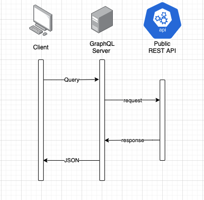
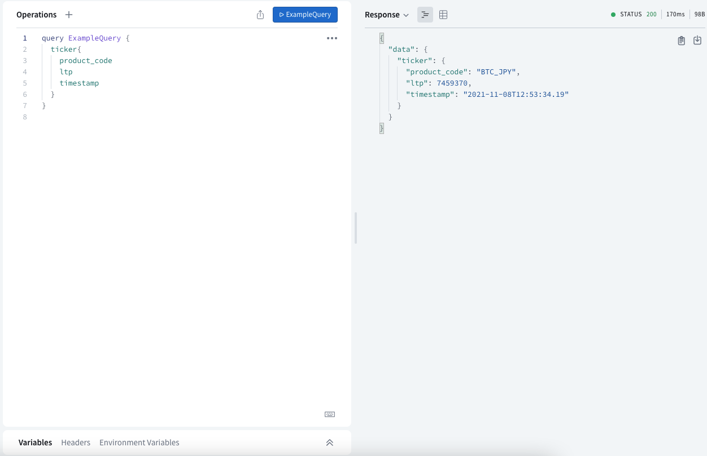
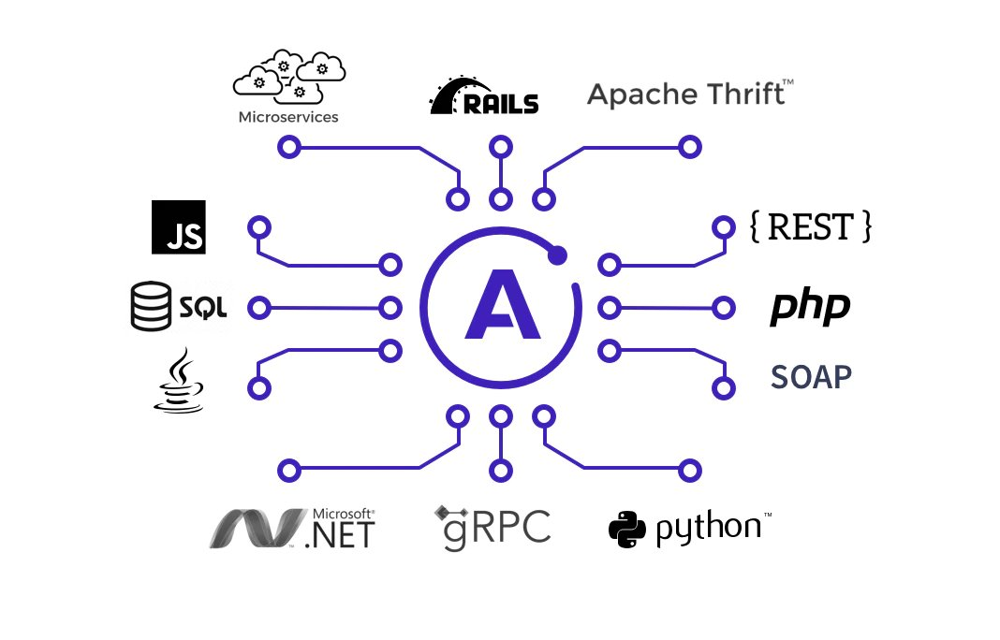

# adapt_graphql_to_rest
## はじめに
### この記事について
クライアントから自前で立てたGraphQLサーバーにQueryを実行し、  
GraphQLサーバーから、他の公開REST APIサーバーへリクエストを実行して、  
そのレスポンスをクライアント側へ返す方法について解説します。

### 完成イメージ



## 前提
### Clientについて
Apolloのsandboxを利用します。  
[Explorer/sandbox/studio](https://studio.apollographql.com/sandbox/explorer)

### GraphQL Serverについて
Node.jsのApollo Serverを利用します。  
本記事ではGraphQLに関する説明は省略しますので、概要は以下のドキュメントを参照してください。  
[GraphQLについて](https://graphql.org/)  
[参考記事](https://www.apollographql.com/docs/apollo-server/getting-started/)


### Public REST APIについて
デモでは、bitflyer lightning API の公開APIを利用します。  
以下のURLに対してリクエストを実行することで、レスポンスとしてTickerの情報を取得します。  
[bitflyer lightning API/Tickerについて](https://lightning.bitflyer.com/docs?lang=ja#ticker)

### 環境
- node v14.17.4
- yarn 1.22.11
    - "apollo-server": "^3.4.1",
    - "axios": "^0.24.0",
    - "graphql": "^16.0.1"

## ポイント
1. GraphQL Server内のスキーマに、tickerのレスポンスデータと同様の型を定義しましょう。
```
const typeDefs = gql`
  type Ticker {
    product_code: String
    state: String
    timestamp: String
    tick_id: Int
    best_bid: Int
    best_ask: Int
    best_bid_size: Float
    best_ask_size: Float
    total_bid_depth: Float
    total_ask_depth: Float
    market_bid_size: Float
    market_ask_size: Float
    ltp:Int
    volume:Float
    volume_by_product:Float
  }

  type Query {
    ticker: Ticker
  }
`;
```
2. GraphQL Server内のリゾルバに、bitflyer lightning API のREST APIに対してリクエストを実行する処理を記載しましょう。  
Query実行時に、GraphQLサーバーからREST APIサーバーへリクエストが実行されます。
```
const resolvers = {
  Query: {
    ticker: async() => {const response = await axios({
        url: 'https://api.bitflyer.com/v1/ticker',
        method: 'get',
      })
      const data = response.data;
      return data;
    }
  }
};
```


## 詳細
### ①作業用ディレクトリの作成
nodeのプロジェクトを開始するための適当なディレクトリを作成しましょう。
```
$ mkdir adapt_gql_to_rest
$ cd adapt_gql_to_rest
```

### ②yarnでプロジェクトを開始、パッケージを追加
yarnでプロジェクトを開始し、パッケージ追加しましょう。
```
$ yarn init -y
$ yarn add apollo-server axios
```

### ③スキーマ/リゾルバ/サーバー起動用スクリプト
index.jsを作成し、スキーマ、リゾルバ、サーバー起動用のスクリプトを記載しましょう。
```index.js
const { ApolloServer, gql } = require("apollo-server");
const axios = require('axios')
# スキーマ
const typeDefs = gql`
  type Ticker {
    product_code: String
    state: String
    timestamp: String
    tick_id: Int
    best_bid: Int
    best_ask: Int
    best_bid_size: Float
    best_ask_size: Float
    total_bid_depth: Float
    total_ask_depth: Float
    market_bid_size: Float
    market_ask_size: Float
    ltp:Int
    volume:Float
    volume_by_product:Float
  }

  type Query {
    ticker: Ticker
  }
`;
# リゾルバ
const resolvers = {
  Query: {
    ticker: async() => {const response = await axios({
        url: 'https://api.bitflyer.com/v1/ticker',
        method: 'get',
      })
      const data = response.data;
      return data;
    }
  }
};

// サーバーを起動する
const server = new ApolloServer({ typeDefs, resolvers });

server.listen().then(({ url }) => {
  console.log(`🚀 Server ready at ${url}`);
});

```

### ④サーバーを起動する
nodeからサーバーを起動してみましょう。
```
$ node index.js
```

### ⑤Queryを実行してみる
[sandbox](https://studio.apollographql.com/sandbox/explorer)にアクセスし、Queryを実行してみましょう。
指定したKeyに対して、対応したValueが取得できれば成功です。



## おわりに
最後までお読みいただき、ありがとうございます。  
記事を読んでいて、「そもそもクライアントから直接REST APIにリクエストを送ればいいんじゃないの？」と  
お考えの方はいらっしゃるかとは思いますが、この記事に関してはその通りですね。。。

ただ、既存のREST APIをGraphQLサーバーで中継するというのは、Apolloサーバーの使い方としては誤っていないかとは思います。  
↓イメージ
  

クライアントからのリクエスト送信先を、REST APIのかわりに中継用のGraphQLサーバーにすることによって、  
下記のメリットが見込めるのではないでしょうか。
- RESTと違い、1回のリクエストで必要なデータを取得できるため、クライアント側のネットワーク負荷が低減できる
- REST APIのエンドポイントの変更の影響をクライアント側が受けない


